# IronClad Case Study Report
##  Sergio Hortner

## Introduction

This project focuses on the design of a retrieval-based face identification system for IronClad, based on the dataset they provided. Given a probe face image, the system must search a gallery of known individuals and return a ranked list of candidate identities. The intended output is therefore not a binary verification decision, but a retrieval result (typically Top-N candidate identities) suitable for automated identification. This approach is suitable when the gallery is fixed, the system must scale to large collections, and the recognition task is naturally posed as ranking candidate identities rather than accepting or rejecting a claimed match.

The system follows a standard embedding-retrieval pipeline. An input image is first preprocessed, then mapped into a fixed-dimensional embedding (a vector representation), using a pretrained face recognition backbone. Gallery embeddings are stored in a vector index, and a probe embedding is matched against that vector index to retrieve the nearest identities. In our implementation, this pipeline is organized into modular components: an extraction layer (`Preprocessing`, `Embedding`), a retrieval layer (`FaissBruteForce`, `FaissHNSW`, `FaissLSH`, `FaissSearch`), and an application layer (``app``) exposing `/add` and `/identify` endpoints for interactive use, reflecting a deliberate separation between representation learning, indexing, and search logic. We use two main libraries: 

i) FaceNet-style embeddings implemented through `facenet_pytorch`, with `casia-webface` and `vggface2` as two alternative pretrained backbones. These embeddings are intended to map images of the same person to nearby points in feature space while efficiently separating different identities. 

ii) We rely FAISS as the indexing and nearest-neighbor retrieval engine. FAISS allows us to study both exact search and approximate nearest-neighbor search under a common interface, making it possible to compare retrieval quality, latency, and scalability under different architectural choices. 

In an additional preprocessing assessment, we will also incorporate MTCNN (implemented from `facenet_pytorch`) to test whether explicit face detection and face cropping improves the quality of the embeddings.

The data are organized into a gallery/probe split under `ironclad/storage/{gallery,probe}`, containing 999 probe identities that are also represented in the gallery, with 2261 gallery images and 999 probe images in total. This split is appropriate for closed-set identification because every probe identity is expected to be present in the gallery, while the gallery itself may contain multiple images per individual. The gallery is also imbalanced, which makes dataset design questions (such as how many images per identity should be retained) substantively important.

Our evaluation strategy is structured to understand the system from three complementary perspectives: representation quality, retrieval architecture, and operational configuration. The analysis proceeds through a sequence of linked design questions addressing the overarching question: *what is the most effective and scalable design for an IronClad face identification system?*

**Section 1: Model selection.** We compare the two embedding backbones, `casia-webface` and `vggface2`, using exact Brute Force retrieval. This isolates the effect of the embedding model from the effect of approximate indexing. We evaluate Top-1, Top-3, and Top-5 identification without noise, then extend the comparison under controlled noise.

**Section 2: MTCNN face detection for preprocessing.** The baseline pipeline only resizes and normalizes images. We test whether inserting MTCNN (Multi-task Cascaded Convolutional Networks, a face detection model that localizes the facial region and returns a confidence score for the detection) as an additional cropping stage before embedding extraction improves identification performance. This section evaluates the same backbones, metrics, and noise conditions as Section 1, now under the enhanced preprocessing pipeline, and asks whether the model ranking established earlier remains stable once the input to the embedding model is redesigned.

**Section 3: Indexing selection.** Once the embedding model is fixed, we study how the choice of vector index (Brute Force, HNSW, or LSH) affects retrieval performance. Here the central tradeoff is between exactness, speed, and scalability. We evaluate these methods both on the real IronClad workload and on larger synthetic benchmarks, because one of the core requirements is to reason about performance as the gallery grows toward very large scale (1B gallery vectors).

**Section 4: Number of returned identities.** We define $N$ as the number of candidate identities returned to the user and analyze how the model performance changes with $N$, designing a method that returns an optimal value given the following tradeoff: larger $N$ improves the chance that the correct identity is present, but reduces the practical usefulness of the shortlist.

**Section 5: Number of gallery images per identity.** We define $m_i$ as the number of gallery images stored for individual $i$, and study how identification changes as gallery representation becomes richer or sparser. This is a dataset design problem rather than a retrieval algorithm problem. Because the gallery is imbalanced, this task requires careful experimental control to distinguish the benefit of more images per identity from the confounding effect of shrinking the set of eligible identities.

For a better understanding of the analysis, it is convenient to recall the notion of index: it is the data structure that organizes the gallery embeddings and supports nearest-neighbor queries against them. Its role is to return the gallery vectors that are closest to a given probe vector under a chosen distance metric. Different index structures implement this search in fundamentally different ways, trading off exactness, speed, and memory. We compare three such structures in this report. Brute Force stores all embeddings in an unstructured flat array and compares the probe exhaustively against every gallery vector at query time. It returns the exact nearest neighbors by construction, but its computational cost grows linearly with gallery size. HNSW (Hierarchical Navigable Small World) organizes the embeddings into a multilayered graph in which each node is connected to a subset of its approximate neighbors; at query time, the search starts at a random entry point in the top layer and greedily descends through the hierarchy, narrowing the candidate set at each level, which allows it to find approximate nearest neighbors in sublinear time while preserving high recall. LSH (Locality Sensitive Hashing) projects each embedding through a family of random hash functions chosen so that nearby vectors in the original space are likely to be mapped to the same hash bucket; at query time, only vectors that share a bucket with the probe are compared, which can make retrieval very fast and memory-efficient, but at the price of a coarser approximation that may miss true neighbors if they fall into different buckets. Sections 1 and 2 use Brute Force exclusively so that performance differences can be attributed to the embedding model and preprocessing rather than to indexing approximation; Section 3 then introduces HNSW and LSH and studies the tradeoff between exactness, speed, and scalability.

In principle we have four distance metrics for evaluating retrieval: Euclidean distance, cosine similarity, dot product, and Minkowski distance. The first three are implemented exactly as native FAISS metrics, meaning that the index directly computes the distance between the probe and every gallery vector (in the case of Brute Force) or its approximate neighbors (in the case of HNSW and LSH). Minkowski distance, however, is not available as a native FAISS metric. In our implementation, it is handled through a two-stage approximation: the system first retrieves a candidate set using one of the three native metrics, then reranks those candidates by their exact Minkowski distance to the probe. For this reason, we treat Minkowski as a supplementary reranking-style metric throughout the report, rather than as a primary retrieval distance on equal footing with the other three.

## 1. Model Selection

The first design question we address is which embedding backbone should we use throughout the system: ``casia-webface`` or ``vggface2``? To answer this question rigorously, we must hold the retrieval architecture fixed and use a Brute Force FAISS search, so that every query was evaluated under exact nearest-neighbor retrieval rather than under an approximate index. This choice ensures that any observed difference in performance is attributable to the embedding model itself, not to search approximation. 

Our design for the evaluation workflow is the following:

* A probe image is first preprocessed and converted into an embedding.
* The embedding is then compared against all gallery embeddings in the index.
* The system returns the nearest gallery embeddings in ranked order, according to the chosen metric:

  * for Euclidean and Minkowski distance, candidates are ordered from smallest distance to largest;
  * for cosine or dot product, candidates are ordered from highest similarity to lowest.
* These retrieved embeddings are finally mapped back to their associated identity labels.

As mentioned above, in this Section the index used is Brute Force FAISS index (exact). This means that the probe embedding is compared exhaustively against all gallery embeddings. An important detail is that our retrieved list will be a list of the Top-$K$ gallery neighbors, not necessarily unique identities. Therefore, if the gallery contains several images of the same person, that identity may appear more than once in the ranked list.

To evaluate performance, we use four complementary metrics:

* Top-K accuracy: measures how often the correct identity appears within the first $K$ retrieved candidates when the probe image is not altered by added noise.

* Average noisy Top-1 accuracy: it measures robustness against noise. The probe image is perturbed using controlled noise (such as blur, resizing, or brightness changes). Top-1 accuracy is computed for each perturbation setting, and these values are then averaged. This summarizes how well the system performs on average when probe quality is degraded.

* Worst noisy Top-1 accuracy: it is the minimum Top-1 accuracy observed across all tested noise conditions. This is a stress-test metric: it quantifies how badly the system can fail under the most difficult perturbation in the evaluation suite.

* Mean Reciprocal Rank (MRR) measures how early the correct identity appears in the ranked retrieval list. For each probe, the reciprocal of the rank of the first correct match is computed as $1/rank$, and these values are then averaged across probes. A higher MRR indicates that the system not only retrieves the correct identity, but tends to place it closer to the top of the ranking. We will report clean MRR (no added noise), average noisy MRR, and worst noisy MRR for the three primary exact metrics (Euclidean, cosine and dot product) and the Minkowski distance (approximated as retrieval + reranking). This provides a complementary ranking-sensitive view of performance beyond Top-K accuracy.

Precision and recall can in principle be defined, but they are not the most appropriate primary metrics for this closed-set identification task. Since the goal is to determine whether the correct identity appears near the top of the ranked retrieval list, Top-K accuracy already provides a direct and interpretable measure of system performance.

The evaluation protocol mirrors the operational conditions of the identification system. Gallery embeddings are kept unperturbed (no added noise), while probe images were evaluated both in their original form and under controlled perturbations representing environmental degradation. Three noise families are considered: Gaussian blur, resizing (downsampling followed by upsampling), and brightness changes.

### Top-K accuracy results

The results on the unperturbed probing set are very clear. On Table 1.1 we observe that, across all three exact metrics, `vggface2` substantially outperforms `casia-webface`. In fact, for each of these two backbones, the results do not vary across the exact distances considered. `vggface2` achieves ``Top-1=0.5065``, ``Top-3=0.6196``, and ``Top-5=0.6647``, whereas `casia-webface` achieves only ``Top-1=0.0931``, ``Top-3=0.1371``, and ``Top-5=0.1632``, respectively. In practical terms, this means that before any robustness considerations are introduced, `vggface2` is already the far stronger backbone for closed-set identification on IronClad.

**Table 1.1.** Model performance for the different metrics.

### Robustness against noise

The robustness analysis against noise leads to the same conclusion. Again, performance metrics do not vary across the chosen exact distances for a given backbone. In Table 1.1, `vggface2` achieves ``average noisy Top-1=0.3999`` and ``worst-case noisy Top-1=0.1622``, whereas `casia-webface` achieves only ``average noisy Top-1=0.0670`` and ``worst-case noisy Top-1=0.0290``. The magnitude of this gap is important: the weaker model is not merely slightly less robust, but dramatically less reliable once the probe is degraded. The explicit noisy-condition rows (see notebook ``task1``, section "Metrics and noise settings") show the same pattern. Under severe Gaussian blur (σ=3), `vggface2` still retains 0.2953 Top-1 accuracy, while `casia-webface` falls to 0.0320. Under aggressive resizing (scale 0.35), `vggface2` retains 0.4705, while `casia-webface` reaches only 0.0731. Under extreme brightness change, the performance drop is again much sharper for `casia-webface`: the most difficult brightness setting yields 0.1622 for `vggface2` and only 0.0551 for `casia-webface`, while heavy darkening drives `casia-webface` as low as 0.0290. The following noise-response curves make the robustness gap visually explicit. 

**Figure 1.1.** Degradation of model performance with noise.

Across all three perturbation families, ``vggface2`` remains consistently above ``casia-webface`` as noise severity increases, confirming that the superiority of the selected backbone is not confined to noiseless retrieval. Gaussian blur shows the clearest monotonic degradation, brightness changes reveal strong sensitivity to extreme illumination, and resizing produces a milder but still consistent separation.

### MRR results

The MRR analysis reinforces the same conclusion. From Table 1.2, across the primary exact metrics, ``vggface2`` also achieves a substantially higher clean MRR than ``casia-webface``, meaning that the correct identity is not only included more often in the top results, but is typically ranked earlier. Concretely, the clean MRR of ``vggface2`` is 0.5796, whereas ``casia-webface`` reaches only 0.1340. Thus, even when both models fail to place the correct identity first, ``vggface2`` tends to rank that identity much closer to the top of the list. Note that the MRR metrics are also independent of the exact distance chosen, for a fixed backbone.

**Table 1.2.** Comparison between Top-1 accuracy and MRR.

The noisy MRR summaries follow the same pattern: ``vggface2`` maintains a clear advantage in both average and worst-case ranking quality under blur, resizing, and brightness perturbations. Its average noisy MRR is 0.4751, compared with only 0.1035 for ``casia-webface``, and its worst noisy MRR is 0.2237, compared with 0.0584 for ``casia-webface``. This shows that even when probe quality is degraded, the stronger backbone continues to place the correct identity substantially earlier in the ranked list.

### Performance under Minkowski distance

The supplementary Minkowski distance analysis also supports the same interpretation. Choosing the Minkowski distance yields marginally better performance values, and it does not overturn the ranking: `vggface2` remains ahead of `casia-webface`.

**Table 1.3.** Model performance with Minkowski metric.

Because the computation of Minkowski is done approximately as a two-stage approach that requires first retrieving a large candidate set and then recomputing distances over it, the MRR computation under Minkowski is very inefficient compared with the native metrics, so we did not include it in our analysis.

### Conclusion

The conclusion from this section is clear: `vggface2` should be selected as the embedding backbone for the IronClad system. It outperforms `casia-webface` on every metric evaluated under all three primary exact distances, and the difference in performance even widens under noise. The choice of exact distance is irrelevant: all three result in the same metric scores. The approximate Minkowski implementation yields only marginally better values without overturning the model ranking. The final choice of distance metric will be revisited after the preprocessing and scaling analyses of Sections 2 and 3.

## 2. MTCNN-Based Preprocessing

The preceding section established a baseline system in which `vggface2` emerged as the strongest embedding backbone. In that baseline design, images are simply resized and normalized before embedding extraction, which implicitly assumes that the face already occupies a sufficiently consistent and informative region of the frame. The next question is therefore whether the preprocessing stage itself should be redesigned to provide the embedding model with a cleaner and more standardized facial input. This section is dedicated to testing whether explicit face detection and cropping can improve identification performance on the IronClad dataset, before any change is made to the embedding model or the retrieval architecture.

To study this question, we introduced MTCNN (Multi-task Cascaded Convolutional Networks) as an additional preprocessing component. MTCNN is a face detector designed to localize faces and provide a confidence score for the detected region. In our implementation, this component is imported from the same `facenet_pytorch` ecosystem already used for FaceNet-style embeddings. Crucially, MTCNN is not used here as a separate recognition model: it is used only to detect and crop the facial region before the existing embedding model is applied. Operationally, the redesigned pipeline is therefore: i) detect face, ii) crop image, iii) apply the baseline preprocessing transforms, iv) compute the embedding and v) perform retrieval.

Our analysis further adopts a confidence-aware cropping policy rather than blindly replacing the baseline image with every detected crop. For each image, MTCNN returns a confidence score associated with the selected face box. A crop is only used if the confidence exceeds a chosen threshold; otherwise, the pipeline falls back to the original image. This design is motivated by the task assumption that the baseline IronClad images are already approximately aligned. If a detection is uncertain, forcing a crop may remove useful context or even crop the wrong region, thereby making the representation worse rather than better. In our analysis we compared the baseline preprocessing of Section 1 against a confidence-aware MTCNN variant (`mtcnn_conf`) and evaluates several thresholds. The results can be found in the ``task2`` notebook.

The threshold sweep showed that thresholds 0.50, 0.60, 0.70, and 0.80 all lay on the same best-performing plateau, whereas 0.90 and 0.95 were only slightly lower. We therefore selected 0.80 as the operational threshold, because it is the most conservative value within the best-performing region. This preserves the confidence-aware fallback principle (accepting only sufficiently reliable detections) without sacrificing identification accuracy.

The evaluation protocol follows the same philosophy we followed in Section 1, so that the new component can be assessed under controlled conditions. Retrieval remains the Brute Force method, as in Section 1, ensuring that any observed change is attributable to the inclusion of MTCNN-based face cropping subroutine in preprocessing. Both embedding backbones, `casia-webface` and `vggface2`, are reevaluated under the three primary exact metrics: Euclidean distance, cosine similarity, and dot product. Performance is summarized exactly as before: clean (no added noise) Top-1 / Top-3 / Top-5, plus average noisy Top-1 and worst-case noisy Top-1 over the same blur, resize, and brightness perturbation grid. In this way, the new preprocessing stage is assessed by the same criteria used in Section 1, enabling a direct comparison.

### Top-K accuracy results

The empirical findings are striking. Under the baseline pipeline, the clean results reproduce the weak-to-moderate values observed earlier: for example, under cosine, `casia-webface` achieves ``Top-1 = 0.0931``, while `vggface2` achieves ``Top-1 = 0.5065``. After introducing MTCNN cropping, these values increase to ``Top-1=0.7778`` and ``Top-1=0.8428``, respectively. The same large gains appear in Top-3 and Top-5 accuracy. For `casia-webface`, clean Top-3 / Top-5 rise from 0.1371 / 0.1632 to 0.8338 / 0.8549; for `vggface2`, they rise from 0.6196 / 0.6647 to 0.8889 / 0.9009. These are not marginal improvements but order-of-magnitude changes for ``casia-webface`` backbone and substantial gains for ``vggface2``. The results are summarized in Table 2.1.

**Table 2.1.** Model performance including MTCNN for face detection and cropping.

### MMR results

The MRR results, also included in Table 2.1, reinforce exactly the same interpretation. Under the baseline pipeline, ``casia-webface`` achieves a clean MRR of only 0.1340, whereas ``vggface2`` reaches 0.5796. After MTCNN cropping, these values increase to 0.8129 for ``casia-webface`` and 0.8692 for ``vggface2``. Thus, face cropping improves not only whether the correct identity appears in the shortlist, but also how early it appears in the ranking. The improvement is especially dramatic for ``casia-webface``, whose baseline ranking quality is very poor, but even after this large gain ``vggface2`` remains the stronger backbone on the clean set.

### Robustness against noise

The robustness analysis, also included in Table 2.1, leads to the same conclusion. We observe the same qualitative ranking and noise sensitivity seen in Section 1 (including independence on the exact distance used for a given backbone), but now the entire response is shifted upward, implying that face cropping improves robustness across all tested noise families and severities. With baseline preprocessing, `casia-webface` reaches only 0.0674 average noisy Top-1 and 0.0290 worst-case noisy Top-1, whereas the MTCNN pipeline raises these to 0.6771 and 0.4224. For `vggface2`, average noisy Top-1 improves from 0.3997 to 0.7468, and worst-case noisy Top-1 from 0.1622 to 0.5185. The scale of these gains is especially important because it shows that cropping does not merely improve nominal retrieval under ideal conditions; it also makes the system substantially more stable under degraded probe quality.

The gains summarized in Table 2.1 are easier to appreciate visually in the noise-response curves. Figure 2.1 compares baseline preprocessing with the MTCNN pipeline under Gaussian blur, resizing, and brightness perturbations. Across all three noise families, the MTCNN curve remains consistently above the baseline curve, showing that cropping improves robustness throughout the tested severity range rather than only at a single operating point.

**Figure 2.1.** Robustness against noise when including MTCNN for face detection and cropping.

The noisy MRR results again support the same story. Under the baseline pipeline, ``casia-webface`` achieves only average noisy MRR = 0.1038 and worst noisy MRR = 0.0584, while ``vggface2`` achieves 0.4752 and 0.2237. After introducing MTCNN, these values rise to 0.7279 and 0.5130 for ``casia-webface``, and to 0.7907 and 0.5972 for ``vggface2``. This shows that MTCNN does not simply increase inclusion accuracy under noise; it also moves the correct identity substantially closer to the top of the ranking under degraded conditions. The effect is again strongest for ``casia-webface`` in absolute terms, but ``vggface2`` remains superior overall, both in typical noisy ranking quality and in worst-case behavior.

### MTCNN + Minkowski distance

The supplementary Minkowski distance analysis supports the same overall conclusion as the exact-distance evaluation. Under Minkowski, both backbones benefited substantially from MTCNN-based cropping, and `vggface2` remained the strongest model in both clean and noisy settings.

**Table 2.2.** Model performance with MTCNN and Minkowski metric.

 

### Conclusion

These results support a clear design recommendation:  he preprocessing pipeline should be redesigned to include MTCNN-based face cropping with a confidence-aware fallback at threshold 0.80. The justification rests on three findings. First, the improvements are large for both backbones: `vggface2` clean Top-1 rises from 0.5065 to 0.8428, and `casia-webface` from 0.0931 to 0.7778. Second, the gains persist across all primary exact distances, confirming that they are a property of the preprocessing improvement rather than an artifact of a particular metric. Third, robustness under noise improves substantially: for `vggface2`, worst-case noisy Top-1 rises from 0.1622 to 0.5185. The confidence-aware fallback policy preserves the baseline image when detection confidence is low, adding a layer of safety at negligible cost. Furthermore, at this stage we can fix cosine similarity as the exact retrieval distance for the remainder of the project: the choice of exact distance (Euclidean, cosine, dot product) does not affect the performance metrics studied so far, but cosine similarity aligns with standard practice for normalized face embeddings. The approximate Minkowski implementation will be evaluated for scalability in Section 3 before a final decision between cosine and Minkowski is made.

Conceptually, we may interpret these findings as follows. The baseline IronClad images may have been roughly aligned, but they were apparently not tightly normalized around the face region in a way that best serves the FaceNet-style embedding backbones. MTCNN effectively reduces irrelevant background, enforces more consistent spatial framing, and allows the embedding model to devote more of its representational capacity to facial structure rather than scene variation. 

## 3. Indexing Selection

Once the embedding backbone and preprocessing pipeline have been fixed, the next design question is how those embeddings should be indexed for retrieval. The purpose of this task is to understand the architectural tradeoff between exactness, speed, memory cost, and scalability. We take the best upstream configuration established earlier (`vggface2` embeddings and MTCNN-based face cropping) and asks which retrieval structure should support that representation in deployment: Brute Force, HNSW, or LSH. In this context, HNSW and LSH are approximate nearest-neighbor (ANN) methods: rather than exhaustively comparing a probe against every gallery embedding, they aim to recover neighbors that are very close to the true nearest neighbors at a much lower computational cost. Because approximate search can fail in two different ways (by returning the wrong identity and by failing to recover the exact nearest vectors), we evaluate not only accuracy metrics but also introduce recall versus Brute Force. Concretely, ``Recall@10`` measures how many of the top ten neighbors returned by exact Brute Force search are also recovered by the approximate index. This metric is useful because it isolates the quality of the index itself: a method may appear strong in Top-1 simply because the task is easy at small scale, while ``Recall@10`` reveals whether it is faithfully reproducing the exact neighborhood structure that Brute Force would.

The three indexing strategies differ conceptually in how they organize the gallery. 

* Brute Force stores all embeddings in a flat index and compares every probe against every gallery vector at query time. It is exact and therefore provides the gold-standard reference for retrieval quality, but its computational cost grows linearly with gallery size. 

* HNSW (Hierarchical Navigable Small World) builds a graph over the embedding space and performs approximate nearest-neighbor search by traversing that graph. Its design aims to preserve high recall while reducing search cost dramatically relative to exhaustive comparison. 

* LSH (Locality-Sensitive Hashing) takes a different approach: it hashes vectors into buckets so that similar vectors are likely to collide. This can make retrieval very fast and memory-efficient, but the price is a more aggressive approximation that may degrade recall. 

Or task is to determine which method provides the strongest tradeoff for a system that must eventually consider galleries far larger than the current IronClad dataset, having in mind a target size of 1B gallery vectors.

Our analysis comprises three stages:

* A hyperparameter tuning phase on the IronClad workload, which is methodologically necessary to ensure that the subsequent comparison reflects the capabilities of each indexing strategy rather than the effect of suboptimal parameter choices.

* We then evaluate all three strategies on the full IronClad gallery, establishing their retrieval quality, latency, and memory characteristics at the current operational scale. 

* Next, we investigate how these properties change as gallery size increases, first by scaling within the real dataset through identity-preserving subsampling, and then by constructing synthetic benchmarks at progressively larger scales, since the IronClad gallery is insufficiently large to reveal the asymptotic behavior of the approximate methods. 

* The synthetic measurements are then extrapolated to a billion-vector gallery to obtain projected memory and latency estimates at the intended deployment scale. 

We also conduct a supplementary analysis under the approximate Minkowski reranking metric to assess whether this alternative distance remains viable as gallery size grows. 

### Hyperparameter tuning

We start by performing a tuning phase on the actual IronClad workload. Because approximate methods depend on their hyperparameters, the comparison would be unfair if HNSW and LSH were evaluated at arbitrary defaults. HNSW is therefore tuned over candidate values of its hyperparameter `efSearch`, and LSH is tuned over candidate values of its hyperparameter `nbits`. Conceptually, `efSearch` controls how many candidate nodes HNSW explores during graph traversal at query time: larger values usually improve recall because the search is more exhaustive, but they also increase latency. By contrast, `nbits` controls the length of the binary hash used by LSH: larger values create finer hash partitions and can improve discrimination between embeddings, but they also increase memory use and may reduce the efficiency of retrieval if the hashing becomes too specific. 

The results of this tuning phase are summarized in Table 3.1, and show that for HNSW, ``efSearch = 16``, ``64``, and ``128`` all reach the same Top-1, Top-5, and Recall@10, but 16 is the fastest, and it is therefore selected. For LSH, accuracy improves monotonically as the hash length increases, so ``nbits = 512`` is selected.

**Table 3.1.** Hyperparameter tuning for HNSW and LSH on the selected vggface2 + MTCNN + cosine pipeline.

### Full IronClad gallery benchmark

In this section we report the evaluation results for the three indexing strategies on the full IronClad gallery. These are summarized in Table 3.2.

Brute Force and HNSW are almost indistinguishable in identification accuracy: Brute Force achieves ``Top-1=0.8428`` and ``Top-5=0.9039``, while HNSW achieves 0.8418 and 0.9029. LSH is clearly weaker, with ``Top-1=0.8038`` and ``Top-5=0.8969``. In other words, at the current IronClad scale, HNSW retains essentially all of the useful retrieval quality of exact search, whereas LSH already begins to pay an accuracy penalty. Query latency favors using approximate methods: Brute Force requires 0.012351 ms/query, HNSW 0.007745 ms/query, and LSH 0.007660 ms/query. 

We also computed ``Recall@10`` vs Brute Force, and at the current IronClad scale this value is 1.0 for all three indices. This is an important nuance: on the present dataset, approximate indexing has not yet begun to lose neighbors relative to exact search at the top-10 level. The architectural interpretation is therefore already visible at this stage: HNSW preserves the quality of exact retrieval much better than LSH while offering lower latency than brute-force search, whereas LSH achieves comparable latency but is less accurate.

**Table 3.2.** Full IronClad dataset benchmark of Brute Force, HNSW, and LSH.

A related trade-off is visible in the memory footprint. On the full real task, Brute Force uses about 2048 bytes/vector, HNSW about 2319.7 bytes/vector, and LSH only 527.8 bytes/vector. This explains why LSH remains attractive as a compact index, but also why it should not automatically be preferred: the extra compactness comes with a noticeable loss in Top-1 and Top-5 identification quality.

### Scaling analysis

We are ready to study how this behavior changes as the number of gallery images increases. We will do so in two complementary ways: using subsets of the actual IronClad gallery, and using a larger synthetic dataset.

**Subsets of the real IronClad dataset**

For this experiment we use an effective gallery whose size is expanded from a smaller identity-preserving subset up to the full gallery, while ensuring that every identity remains represented by at least one anchor image. This design matters because a naive random subsample would conflate scaling with closed-set failure: identities could simply disappear from the gallery. 
The real-data scaling curves make the quality comparison easier to see than the raw table alone. As the gallery size grows, Brute Force and HNSW remain almost indistinguishable in Top-1 accuracy, while LSH stays consistently below them. On the actual IronClad task, HNSW preserves the practical quality of exact search much better than LSH as scale increases.

**Figure 3.1.** Top-1 accuracy vs gallery size plot.

At the same time, ``Recall@10`` remains 1.0 for all methods across the real scaling experiment. This shows that the current IronClad gallery is still too small to expose a strong ANN-quality gap in recall terms. This justifies the introduction of a synthetic large-scale benchmark later.

The latency curves complement the accuracy results by revealing the computational cost of scaling the gallery. As the number of images increases, Brute Force latency grows more sharply, while HNSW stays lower and preserves nearly the same Top-1 performance. LSH also remains fast, but the earlier figure shows that this speed advantage comes with a noticeable loss in retrieval quality.

**Figure 3.2.** Latency vs gallery size plot.

Table 3.3 reports the real-data scaling benchmark on the IronClad gallery as the number of indexed images increases. Its main purpose is to show how Brute Force, HNSW, and LSH behave under progressively larger but still realistic gallery sizes, both in retrieval quality and in query cost. The table shows that, within the range available in the real dataset, all three methods remain very close in accuracy and Recall@10, while ANN methods retain a latency advantage over exhaustive search.

**Table 3.3.** Real-data scaling benchmark as the number of gallery images increases.

**Synthetic data benchmark**

The IronClad gallery is still far smaller than the 1B-image gallery target, so we cannot draw yet any conclusions about the asymptotic behavior from these results. For that purpose, we need to performed a synthetic large-scale benchmark acting as an extrapolation device: it is impossible to build and benchmark a literal 1B-vector index within our environment, so instead we generate synthetic normalized 512-dimensional vectors at progressively larger sizes (50k, 200k, and 500k) and measure build time, per-query latency, recall relative to Brute Force, and serialized index size. These points are then used to estimate the behavior of each method as an extrapolation at one billion vectors. The results are summarized in Table 3.4.

**Table 3.4.** Synthetic data benchmark.

Conceptually, this synthetic benchmark isolates the indexing asymptotics from the dataset semantics: preprocessing and model choice affect the distribution of embeddings, but they do not change the basic memory and time growth laws of the data structures themselves. 

The synthetic Recall@10 curves expose the ANN-quality gap that is not yet visible on the real dataset. Figure 3.3 shows why the deployment decision cannot be based on the real-task results alone: as synthetic gallery size increases, ANN quality degrades substantially, especially for LSH. The figure supports preferring HNSW over LSH when retrieval fidelity is the priority at large scale.

**Figure 3.3.** Recall@10 vs synthetic $N$.

Brute Force remains exact by construction, but its measured query latency increases from 0.365 ms/query at 50k vectors to 2.988 ms/query at 500k. HNSW remains substantially faster over this range, with query latency rising only from 0.130 to 0.160 ms/query, while also preserving a much stronger large-scale recall profile than LSH: at 500k vectors, HNSW retains Recall@10 = 0.490 versus only 0.055 for LSH.

**Figure 3.4.** Latency vs synthetic $N$.

The synthetic benchmark in Table 3.4 also highlights a sharp memory tradeoff across indexing methods. Brute Force has the largest storage footprint in absolute terms among the exact baselines, requiring about 2048 bytes per vector, which scales linearly from roughly 102 MB at 50k vectors to 1.02 GB at 500k. HNSW is even more memory-intensive, at about 2320 bytes per vector, reflecting the additional graph structure needed to support fast search; its serialized index grows from about 116 MB at 50k to 1.16 GB at 500k. By contrast, LSH is dramatically more compact, requiring only about 66-85 bytes per vector, with total index size staying between roughly 4.2 MB at 50k and 33.0 MB at 500k. The memory results therefore make the tradeoff explicit: LSH is by far the most storage-efficient option, Brute Force is substantially heavier, and HNSW is the most memory-demanding of the three.

Overall, the synthetic benchmark reveals the following asymptotic behavior: Brute Force becomes too slow, LSH becomes too inaccurate, and HNSW remains the most plausible compromise. 

### Extrapolation to 1B vector gallery

Let us now proceed to the extrapolation to a 1B vector database. This step uses the synthetic benchmark to extrapolate at 1B-size scale on the two quantities that matter most operationally: memory and query latency. For memory, we simply scale the measured bytes per vector linearly to a target gallery of $10^9$ vectors, which is appropriate because serialized index size is fundamentally a storage quantity that grows approximately in proportion to the number of stored embeddings (once fixed overhead becomes negligible). For latency, we extrapolate by fitting a power law $y=aN^b$ to the observed synthetic latency curve in log-log space over $N={50000, 200000, 500000}$ and then evaluate that fit at $N=10^9$. This choice is justified because query time need not grow linearly across indexing methods, and the power-law fit provides a simple empirical model of their asymptotic scaling trend. The resulting table should therefore be read as an extrapolation from measured synthetic behavior, not as a direct benchmark at production scale.

**Table 3.5.** Extrapolated billion-scale memory and latency estimates, with recall reported at the largest synthetic benchmark.

Table 3.5 reports the extrapolated memory and latency characteristics of each indexing method at $N=10^9$. The table includes the estimated bytes per vector, the corresponding projected memory requirement for a 1B-vector gallery, the fitted latency-growth exponent, and the resulting estimated query latency at 1B, while retaining Recall@10 at the largest measured synthetic size as a reference indicator of retrieval fidelity.

The three indexing strategies occupy clearly different regions of the design space. HNSW yields the lowest projected query latency at approximately 0.338 ms/query, but at the cost of the largest memory footprint, about 2160.8 GB for one billion vectors. LSH is dramatically more memory-efficient, at only about 61.6 GB, but this compactness comes with much weaker retrieval fidelity (Recall@10 = 0.055) and a much slower projected query time of about 434.7 ms/query. Brute Force remains exact by construction (Recall@10 = 1.0), but its projected query latency rises to roughly 3070.2 ms/query, while still requiring about 1907.3 GB of memory.

These estimates make the architectural tradeoff more explicit than the real-task benchmark alone. Brute Force preserves exact retrieval but becomes operationally implausible at billion scale because of latency. LSH minimizes storage, but its synthetic recall collapses so sharply that its memory advantage is purchased at too great a loss in retrieval fidelity. HNSW is therefore the most credible deployment compromise in this analysis: it is not the cheapest structure in memory terms, but it is the only approximate method that combines sub-millisecond projected latency with a meaningfully stronger large-scale recall profile than LSH.

We should remain cautious when interpretating these values. Because the extrapolation is based on only three synthetic benchmark sizes and a fitted power-law latency curve, the absolute 1B latency values should be read as comparative scaling indicators, not production predictions. Within that limitation, however, the conclusion is clear: if the deployment target is a gallery on the order of one billion embeddings, the evidence favors HNSW as the most plausible indexing strategy among the three candidates.

The final architectural conclusion is therefore clear. For the IronClad system, the retrieval backend should be tuned HNSW built over `vggface2` embeddings extracted from the MTCNN-enhanced preprocessing pipeline.

### Indexing analysis using Minkowski distance

We also ran a supplementary indexing analysis using the Minkowski retrieval distance and the same upstream representation (``vggface2`` embeddings with MTCNN preprocessing). In our setup, Minkowski is not available as a native FAISS retrieval metric, so the pipeline is implemented approximately: an index first retrieves a candidate set, which is then reranked with exact Minkowski distance. The selected configuration for this setting is ``efSearch = 32`` for HNSW and ``nbits = 512`` for LSH.

At the scale of the IronClad gallery, the Minkowski results do not yet reveal a meaningful separation between indexing strategies. This indicates that the IronClad dataset is too small to expose the deployment bottleneck under this metric. The decisive evidence comes from the synthetic scaling benchmark. We evaluated synthetic galleries of 25k, 75k, and 125k vectors, and measured latency, memory footprint, and recall against the exact neighbor set. We observed that performance quality deteriorates sharply as scale increases: at the largest measured synthetic size, HNSW retains only ``Recall@10 = 0.24``, while LSH falls to 0.08. 

**Table 3.6.** Synthetic data benchmark using the (approximate) Minkowski distance.

The corresponding 1B extrapolation is even less encouraging: LSH has a projected latency about $5.87\cdot 10^4$ ms/query, while HNSW has an even more unstable projected latency estimate of $1.52\cdot 10^4$ ms/query. Brute Force remains exact, but its projected latency ($5.14\cdot 10^{13}$ ms/query) is clearly impractical.

**Table 3.7.** Extrapolated billion-scale memory and latency estimates using the (approximate) Minkowski distance.

Taken together, these results do not support Minkowski as a scalable deployment metric for this problem, so we will exclude it from the main decision framework. Therefore, our final model choice is: ``vggface2`` + MTCNN + cosine similarity.

### Conclusion

The retrieval backend for the IronClad system should use HNSW, built over `vggface2` embeddings extracted from the MTCNN-enhanced preprocessing pipeline with cosine similarity. Three lines of evidence support this conclusion. First, on the IronClad gallery, HNSW essentially matches Brute Force in identification accuracy while offering lower query latency, whereas LSH already shows a noticeable accuracy worsening. Second, the synthetic scaling benchmark reveals the following asymptotic behavior: as gallery size grows, Brute Force becomes too slow, LSH loses too much recall, and HNSW remains the only method that combines sub-millisecond projected latency with meaningfully stronger retrieval fidelity (Recall@10 = 0.490 at 500k). Third, the supplementary Minkowski analysis shows that this approximate reranking metric does not scale well under any indexing strategy, with projected billion-scale latencies that are operationally impractical. This eliminates Minkowski from the deployment framework and confirms cosine similarity as the final retrieval distance. The recommended configuration for deployment is therefore: `vggface2` + MTCNN + cosine similarity + HNSW.

## 4. Number of Identities Returned

The next design question concerns the operational usefulness of the final IronClad face identification system. Up to this point, the analysis has established how the system should represent face images (fixing the optimal embedding and retrieval distance, and including preprocessing enhancements) and how the gallery should be searched (determining the optimal index retrieval). What remains is to decide how much information the system should return to the user. In a retrieval-based identification setting, the system does not output a single binary decision. Rather, it returns a ranked shortlist of candidate identities. The key parameter in this section is therefore $N$, the number of identities returned in that shortlist. Note that this is not a cosmetic choice but a deployment-critical one: if the system returns too few identities, it risks omitting the correct person and reducing identification reliability; if it returns too many, it shifts the burden of decision-making back to the user, weakening the possibility of automation. Our goal is to design a method to determine the optimal value of $N$ under the previous considerations for casia-webface and vggface2 on the provided gallery/probe split, and then to study how that required shortlist size changes under Brute Force, HNSW, and LSH retrieval. The notion of optimality here involves identifying the smallest shortlist of returned identities that preserves nearly all achievable identification performance. In other words, our system should be accurate enough to capture the correct identity, yet selective enough to remain useful in practice.

A first conceptual clarification is necessary. In this project, the gallery contains multiple images per identity. For that reason, Top-N images and Top-N identities are not the same object. If the system simply returns the nearest gallery vectors, the same person may appear several times in the ranked list, increasing the length of the returned list without adding any useful information. We therefore define $N$ as the number of unique candidate identities returned to the user after deduplicating image-level neighbors by identity. This implies a change the evaluation metric with respect to previous sections: the suitable metric is ``Candidate Identity Recall@N``, defined as the fraction of probes for which the true identity appears among the Top-N returned identities. A larger $N$ almost always improves recall, so $N$ cannot be chosen simply by maximizing ``Recall@N``. Instead, we will adopt the following rule: choose the smallest shortlist size that lies within one percentage point of the best tested recall and is already on the plateau of the curve. Formally, this gives a practical operating point $`N^* = \min \{ N : \text{Recall@}N \geq \text{Recall@}N_{\max} - \delta \}`$ with a small tolerance and elbow check. Under this rule, once additional candidates produce only negligible gains, they are not returned.

Operationally, the workflow is: i) retrieve raw gallery neighbors, ii) group them by identity, iii) assign each identity a score, iv) rank identities rather than images, and v) return the highest-ranked $N$ unique identities.

**Identity-level scoring methods**

Redefining the output unit from images to identities also raises a design question about how identities should be scored. We will compare two conceptually reasonable approaches in this analysis:

* A baseline, first-hit method. The system retrieves the nearest gallery images, deduplicates by identity, and scores each identity by the similarity of its best matching image to the probe. This is the most natural extension of the image-level pipeline studied in earlier sections: identities are ranked by their single strongest gallery representative.

* A template centroid method. The system precomputes a single embedding centroid for each identity by averaging all gallery embeddings belonging to that individual, then normalizes the result to unit length. At query time, the probe is compared directly against these identity-level centroid templates, and identities are ranked by similarity to the centroid. This approach was introduced in the face-recognition literature as a way to build compact and robust gallery representations: the idea of using averaged template representations for verification and identification is a standard component of modern face-recognition pipelines (see, for example, Schroff et al., *FaceNet: A Unified Embedding for Face Recognition and Clustering* in Proceedings of the IEEE Conference on Computer Vision and Pattern Recognition (CVPR 2015), and the template-aggregation strategies in the IARPA Janus benchmarks). The centroid representation has the additional advantage of reducing the gallery to exactly one vector per identity, which simplifies retrieval and makes the output naturally identity-level without requiring post-hoc deduplication.

Both methods are evaluated under exact Brute Force retrieval with the MTCNN-enhanced ``vggface2`` and ``casia-webface`` pipelines, using cosine similarity. The evaluation sweeps $N$ from 1 to 20 and reports the ``Candidate Identity Recall@N`` for each of these values. In addition, three fixed-coverage thresholds are recorded: ``k_for_90pctk``, ``k_for_95pctk``, ``k_for_99pct``, defined as the smallest $N$ at which ``Recall@N`` reaches 90%, 95%, and 99% of the probe set, respectively. These thresholds are informative because they quantify how large the shortlist must be to reach specific operational coverage targets, and they expose the long tail of difficult probes that require progressively larger $N$.

### Comparing the two identity-level methods

The method comparison is summarized in Table 4.1. For `vggface2`, the template centroid method achieves ``Recall@1 = 0.8539``, ``Recall@3 = 0.8989``, ``Recall@5 = 0.9149``, and ``Recall@10 = 0.9239``, while the baseline first-hit method achieves ``Recall@1 = 0.8388``, ``Recall@3 = 0.8989``, ``Recall@5 = 0.9079``, and ``Recall@10 = 0.9229``. For `casia-webface`, the centroid method achieves ``Recall@1 = 0.7978``, ``Recall@3 = 0.8629``, ``Recall@5 = 0.8779``, and ``Recall@10 = 0.8919``, compared with 0.7828, 0.8478, 0.8659, and 0.8849 for the first-hit baseline, respectively. In both cases, the centroid method achieves equal or slightly higher accuracy at every $N$, with the largest advantage appearing at ``Recall@1``.

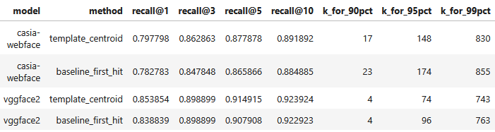

**Table 4.1.** Comparison of identity-level scoring methods under exact Brute Force search, for both backbones.

The fixed-coverage columns reveal a more pronounced difference. For `vggface2`, the centroid method reaches 90% coverage at $N=4$, while the first-hit method also reaches it at $N=4$. However, at the 95% coverage level, the centroid method requires $N=74$ compared with $N=96$ for first-hit, and at the 99% level the gap widens further (743 vs 763). For `casia-webface`, the difference is even more striking: the centroid method reaches 90% at $N=17$ while first-hit requires $N=23$, and at 95% coverage the centroid needs $N=148$ versus $N=174$ for first-hit. These fixed-coverage values are important because they characterize the tail behavior of the identification problem: even under the best pipeline, a small fraction of probe identities are genuinely difficult, and reaching them requires substantially larger shortlists. The centroid method consistently requires a shorter list to reach the same coverage level, which supports its selection as the preferred identity-level scoring rule.

The Recall@N curves make the comparison visually explicit. Figure 4.1 plots Recall@N for both methods, separately for each backbone. Both curves rise steeply between $N=1$ and $N \approx 5$, then flatten as diminishing returns set in. The centroid method sits at or above the first-hit curve throughout the tested range, confirming that centroid-based identity scoring is the stronger approach for this task. On the basis of this comparison, the template centroid method is selected as the preferred identity-level scoring rule for both backbones.

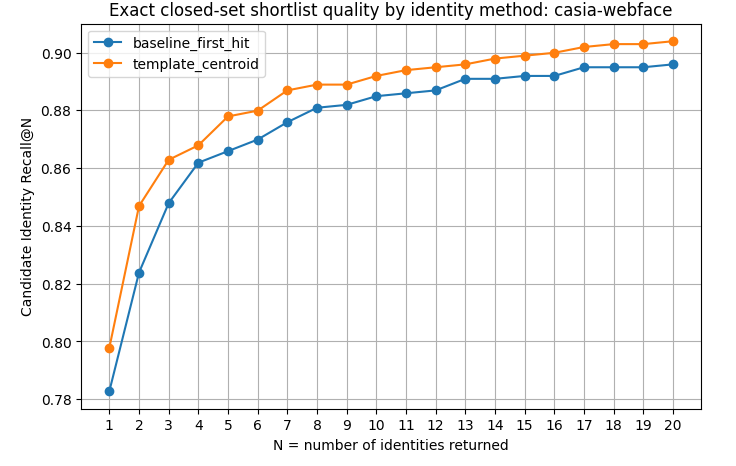

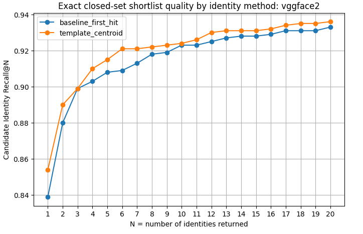

**Figure 4.1.** Candidate Identity Recall@N for the two identity-level scoring methods under exact search, shown separately for `casia-webface` and `vggface2`.

### Choosing a practical shortlist size $N^*$

For the centroid method, we now return to the central question: what is the optimal value of $N$? The selection rule used in this analysis is $`N^* = \min \{ N : \text{Recall@}N \geq \text{Recall@}N_{\max} - \delta \}`$, where $`N^*`$ is the optimal value, $N_{\max}=20$ is the upper bound of the sweep range and $\delta=0.01$ is a small tolerance. The logic is that once Recall@N comes within $\delta$ of the best achievable recall in the tested range, further increases in $N$ produce only marginal gains while making the shortlist longer and less useful. An additional elbow check ensures that $`N^*`$ is not placed in a region of steep marginal improvement. This rule provides a data-driven recommendation for deployment without requiring an arbitrary fixed threshold.

The results of this selection procedure are reported in Table 4.2. For `vggface2`, the peak recall within the tested range is 0.9359 at $N=20$, and the smallest $N$ within $\delta=0.01$ of that peak is $N^* = 12$, at which ``Recall@N=0.9299``. For `casia-webface`, the peak recall is 0.9039 at $N=20$, and $N^* = 12$ achieves 0.8949. Both backbones therefore converge on the same practical shortlist size under this criterion, although `vggface2` reaches higher absolute recall at every point.

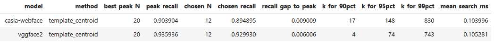

**Table 4.2.** Shortlist size $N^*$ for the template centroid method, with fixed-coverage shortlist targets.

The shortlist curves are shown in Figure 4.2, which overlays both backbones on a single ``Recall@N`` plot using the centroid method. The characteristic shape is a steep initial rise (most of the correct identities are found within the first few candidates) followed by a long, flat tail. The recommended $N^* = 12$ sits at the transition between the region of substantial gains and the region of diminishing returns, confirming that the selection rule captures the natural structure of the identification task.

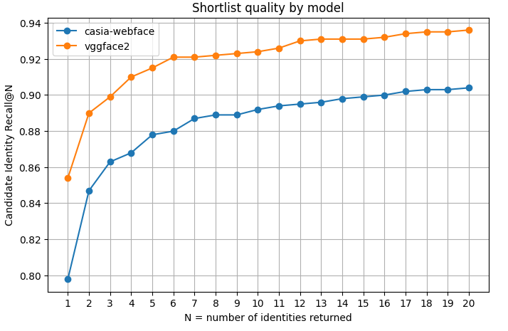

**Figure 4.2.** Candidate Identity Recall@N for both backbones, with the shortlist size $N^* $ indicated.

It is worth interpreting the fixed-coverage targets in conjunction with the $`N^*`$ recommendation. At $N^* = 12$, `vggface2` already covers approximately 93% of probes, and reaching 95% coverage would require roughly $N = 74$, while 99% coverage would demand $N \approx 743$. For `casia-webface`, the corresponding values are even larger (95% at $N \approx 148$, 99% at $N \approx 830$). These numbers reveal the heavy tail of the identification problem: a small fraction of identities are sufficiently ambiguous in the embedding space that they can only be recovered with very large shortlists. In practice, $N^* = 12$ provides the best balance between coverage and compactness for both models. The stronger backbone (`vggface2`) reaches substantially higher coverage at the same shortlist size, which is yet another reason to prefer it.

### Effect of the indexing strategy on $N$

The analysis so far has used exact Brute Force retrieval to establish the reference shortlist size. In deployment, however, the system will use an approximate index (as studied in Section 3). Because approximate search may not recover exactly the same neighbors as exact search, the shortlist size required to match a given recall target may change. The question is therefore: how much does the required $N$ increase when moving from Brute Force to HNSW or LSH?

To answer this, we hold the identity scoring method fixed (template centroid), take the Brute Force $N^* = 12$ and its associated recall as the reference target, and then find the smallest $N$ at which HNSW and LSH achieve at least the same recall. The ANN indices use the same hyperparameters tuned in Section 3 (`efSearch = 16` for HNSW, `nbits = 512` for LSH). The results are shown in Table 4.3.

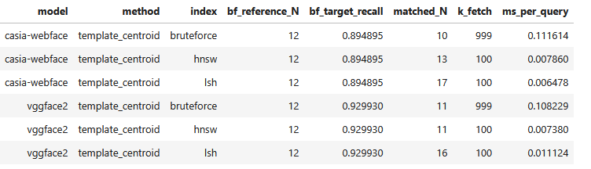

**Table 4.3.** Smallest shortlist size required for each index to match the Brute Force recall at $N^* = 12$.

For `vggface2`, HNSW matches the Brute Force target recall at $N = 11$, and LSH requires $N = 16$. For `casia-webface`, HNSW needs $N = 13$, while LSH requires $N = 17$. The Brute Force reference itself achieves the target at $N = 11$ for `vggface2` and $N = 10$ for `casia-webface` (slightly below the nominal $N^* = 12$ because the matching procedure searches for the minimum $N$ that reaches the target recall, which may be lower than $N^*$ itself). The interpretation is clear: HNSW preserves the Brute Force neighborhood so faithfully that the required shortlist size is essentially unchanged, while LSH requires a moderately longer list to compensate for its weaker retrieval fidelity. This pattern is consistent with the Recall@10 analysis of Section 3, where HNSW closely tracked Brute Force while LSH already showed signs of approximation loss.

The Recall@N curves under different indices are shown in Figure 4.3, separately for each backbone. In both cases, the Brute Force and HNSW curves are nearly superimposed, while the LSH curve sits noticeably below them, especially in the steep-gain region ($N = 1$ to $N \approx 5$). This confirms that the choice of indexing strategy affects not only retrieval latency (as studied in Section 3) but also the required shortlist size: a weaker index forces the system to return more identities to achieve the same coverage.

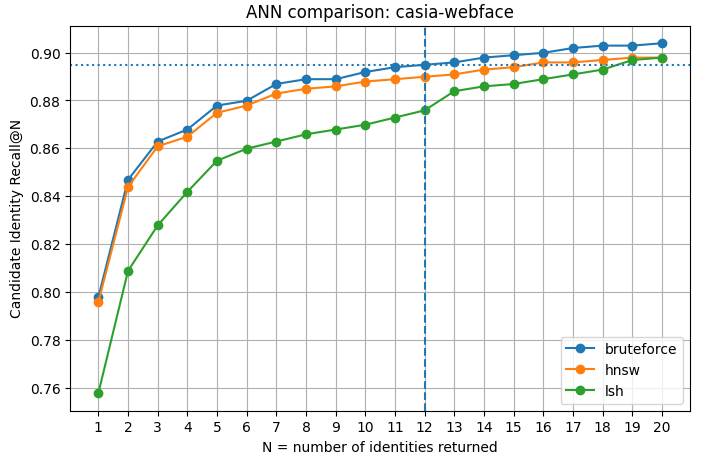

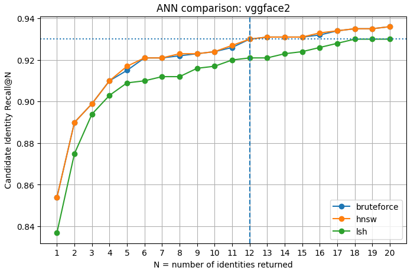

**Figure 4.3.** Candidate Identity Recall@N under Brute Force, HNSW, and LSH, for `casia-webface` and `vggface2`.

### Confidence-aware output policy

The fixed shortlist recommendation $N^* = 12$ treats every probe uniformly: the system always returns the same number of candidate identities regardless of how confident the match is. In practice, many probes produce a dominant first-ranked identity with a wide margin over the second-best candidate, while only  a minority of probes are genuinely ambiguous. This observation motivates a simple confidence-aware output policy: if the system is confident in its top candidate, return only Top-1; otherwise, return a longer shortlist.

The confidence signal used here is the margin, defined as the difference between the similarity score of the best identity (rank-1) and that of the second-best identity (rank-2). A large margin indicates that the top candidate is well separated from the alternatives, suggesting high confidence; a small margin suggests ambiguity. The output rule is:

* If $\text{margin} \geq \tau$, return only the Top-1 identity.
* If $\text{margin} < \tau$, return a fallback shortlist of Top-5 identities.

The threshold $\tau$ is calibrated from the closed-set evaluation: it is set to the 95th percentile of margins among probes where the Top-1 identity was incorrect. The logic is that margins below $\tau$ are characteristic of cases where the system is likely to be wrong, so a longer shortlist is warranted; margins above $\tau$ are characteristic of confident and usually correct predictions, so Top-1 alone suffices. This is a practical heuristic rather than a formal decision-theoretic calibration, but it provides a meaningful reduction in the average shortlist length without substantially sacrificing coverage.

The policy results are summarized in Table 4.4. For `vggface2`, the calibrated threshold is $\tau = 0.1181$. Under this policy, 68.6% of probes are resolved as Top-1 (meaning the system returns a single identity), and the average number of identities returned per query drops from 12 to 2.26. The coverage (fraction of probes for which the correct identity appears in the returned list) is 0.9149, and the rate of incorrect auto-resolved Top-1 predictions is only 0.80%. For `casia-webface`, $\tau = 0.0830$, the Top-1 rate is 63.5%, the average returned shortlist size is 2.46, and coverage is 0.8709 with an incorrect Top-1 rate of 1.10%.

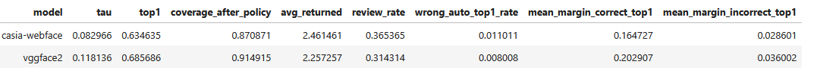

**Table 4.4.** Confidence-aware output policy results for both backbones under the template centroid method.

The margin distributions provide intuition for why this policy works. Figure 4.4 shows the distribution of margins for correct Top-1 probes and incorrect Top-1 probes, separately for each backbone. In both cases, the correct predictions concentrate at higher margins, while incorrect predictions cluster at lower margins. The overlap is small enough that a single threshold cleanly separates most "confident and correct" cases from "uncertain and potentially wrong" cases.

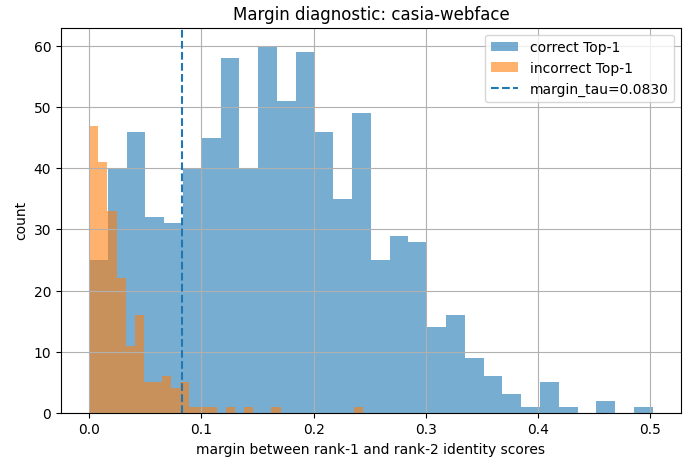

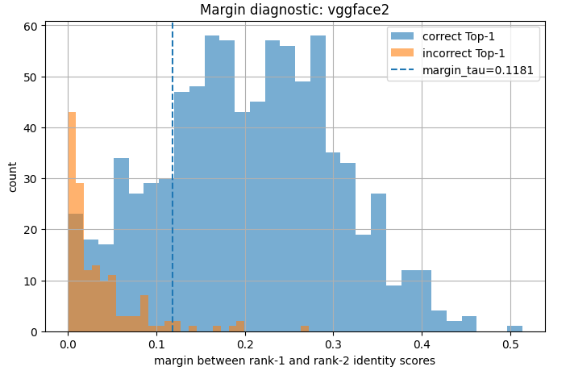

**Figure 4.4.** Margin distributions for correct vs. incorrect Top-1 predictions, for `casia-webface` and `vggface2`.

### Conclusion

The analysis in this section leads to the following conclusions. First, the template centroid method is preferred over the baseline first-hit approach as the identity-level scoring rule, because it achieves equal or higher recall at every $N$ and requires consistently shorter shortlists to reach fixed-coverage targets. Second, the practical shortlist size under exact search is $N^*=12$ for both backbones, chosen by a criterion that balances coverage against shortlist compactness. At this operating point, ``vggface2`` achieves Recall@12 = 0.9299. Third, the choice of indexing strategy modestly affects the required shortlist size. HNSW preserves the Brute Force neighborhood so well that the shortlist size is essentially unchanged ($N=11$ for ``vggface2``, $N=13$ for ``casia-webface``), while LSH requires a moderately longer list to compensate for its weaker retrieval fidelity. This further supports the architectural recommendation from Section 3: HNSW is preferable not only on latency and recall grounds, but also because it does not force the system to widen its output shortlist. Fourth, a simple confidence-aware output policy can reduce the average number of returned identities from 12 to approximately 2.3 for ``vggface2`` and 2.5 for ``casia-webface`` (in practice, 2-3), while preserving the vast majority of closed-set coverage. This shows that a fixed $N$ is a conservative upper bound, and that in most queries the system can confidently resolve the identity with a much shorter output.

Taken together, these results strengthen our choice of ``vggface2`` + MTCNN + cosine + HNSW as the preferred configuration, and suggest $N^* = 12$ as the recommended fixed shortlist size for the IronClad dataset. For deployments where a shorter average length of the returned list is strongly preferred, the designed confidence-aware policy returns shorter lists (2-3 identities) on easy queries while preserving longer shortlists for ambiguous ones.

## 5. Optimize the Number of Images in the Gallery (Dataset Design)

The preceding sections have fixed the representation (`vggface2`), the preprocessing pipeline (MTCNN-based face cropping), the retrieval metric (cosine similarity), the indexing strategy (HNSW), and the shortlist length ($N^* = 12$). The remaining design question concerns the composition of the gallery itself: what is the optimal number of images to store in the gallery for each identity? We define $m_i$ as the number of gallery images available for identity $i$, and we investigate how retrieval performance changes as this quantity varies. Conceptually, increasing $m_i$ can improve identification because the gallery captures more intra-class variation for a given person (different poses, lighting conditions, or facial appearance changes), thereby making the stored representation more robust. However, not every identity in the gallery has the same number of images. If we require at least $m$ images per identity, then any individual with fewer than $m$ gallery images must be excluded from the experiment entirely. As $m$ increases, more and more identities fail to meet this threshold and drop out of both the gallery and the evaluation set. We study this problem under the MTCNN-enhanced pipeline with exact Brute Force retrieval, so that the effect of gallery design is isolated from indexing approximation.

This task is methodologically more subtle than the earlier ones. A naive experiment that simply increases $m$ and measures the resulting accuracy would mix together two effects. The first is the effect we actually want to study: more images per identity may improve recognition because the gallery representation becomes richer. The second is a confound: as $m$ increases, identities that do not have enough images are dropped from the gallery, and the evaluation is conducted over a progressively smaller and potentially easier set of identities. If many of the dropped identities are the difficult ones (for instance, those with only a single, possibly unrepresentative gallery image), then the apparent accuracy improvement at high $m$ partly reflects the removal of hard cases rather than a genuine benefit of richer gallery representation. Our analysis addresses this confound by designing two complementary experiments.

### Experiment 1: Coverage tradeoff design

In the first experiment, we sweep $m$ from 1 to 10 and, for each value, apply the following procedure: retain only the identities that have at least $m$ gallery images, sample exactly $m$ images for each retained identity, keep only the probes that belong to those retained identities, build a Brute Force index from the sampled gallery, and evaluate Top-1 and Top-5 accuracy. Because the sampling is random (which $m$ images are selected when an identity has more than $m$ available), each evaluation is repeated over three random seeds and the results are averaged. This design captures the operational tradeoff: larger $m$ yields more gallery evidence per person, but at the cost of a shrinking evaluation set, because fewer and fewer individuals have enough images to remain eligible.

### Experiment 2: Constant identity set design

The second experiment is designed to isolate the pure effect of gallery richness from the confound of identity attrition. The idea is the following: we first identify the subset of identities that have at least $m_{\max}=10$ gallery images (51 identities on IronClad). This subset is then held fixed throughout the entire experiment (the same 51 identities and the same 51 probe images are used at every value of $m$). What changes is only how many of each identity's gallery images are included in the index: at $m=1$, we sample one gallery image per identity; at $m=2$, two; and so on up to $m=10$, where all available images are used. As in the first experiment, we evaluate Top-1 and Top-5 accuracy, the sampling is repeated over three random seeds, and the results are averaged. Because the set of people being recognized never changes, any improvement in accuracy as $m$ grows can be attributed entirely to the richer gallery representation, not to the removal of difficult identities.

The need for both experiments is especially strong on IronClad because the gallery-image distribution is highly imbalanced. Table 5.1 reports the descriptive statistics.

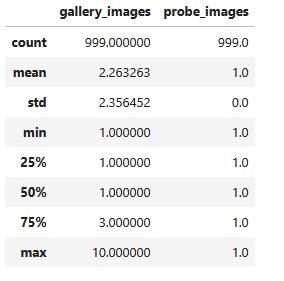

**Table 5.1.** Descriptive statistics of the gallery-image distribution.

Across the 999 overlap identities (appearing both in the gallery and probe sets), the mean number of gallery images per identity is only about 2.26, the median is 1, the 75th percentile is 3, and the maximum is 10. In other words, the majority of identities have very few gallery images, and only a small minority can support large values of $m$. This means that any recommendation for $m$ must be interpreted jointly with its coverage (the number of identities that pass the $m$-image filter); otherwise, one would risk selecting a value that appears optimal only because it excludes most of the dataset.

### Coverage collapse as $m$ increases

The coverage tradeoff experiment makes this problem visually explicit. Figure 5.1 plots the number of retained identities as a function of $m$.

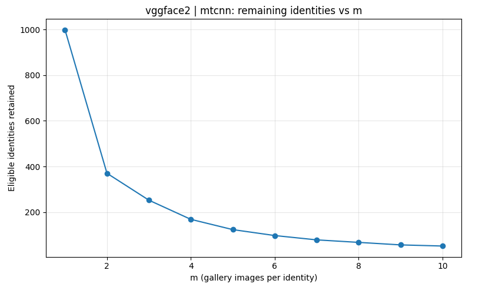

**Figure 5.1.** Number of retained identities as a function of the minimum gallery-image requirement $m$. Because eligibility depends only on gallery-image counts, this curve is the same regardless of the embedding model or preprocessing variant.

At $m=1$, all 999 overlap identities are available. Requiring just $m=2$ images already reduces coverage to 370 identities. The decline continues sharply: 252 identities remain at $m=3$, 168 at $m=4$, 123 at $m=5$, and only 97 at $m=6$. By $m=9$ and $m=10$, the experiment retains only 56 and 51 identities, respectively. This steep loss of coverage shows why interpreting the coverage tradeoff results in isolation would be misleading: a substantial portion of any apparent improvement at high $m$ comes from solving a much smaller, and therefore easier, recognition problem.

### Comparing the two experiments

The comparison between the two experiments is the key conceptual result of this section, and is summarized in Table 5.2. The table reports the recommended $m$, the Top-1 accuracy at that point, the maximum Top-1 over the tested range, and the number of retained identities and probes.

Under the MTCNN-enhanced pipeline, the coverage-tradeoff experiment selects $m = 9$ as the near-optimal point for both backbones. For `casia-webface`, this yields ``Top-1=0.9762`` with 56 retained identities; for `vggface2`, it yields ``Top-1=0.9821``, again with 56 retained identities. These values are very high, but they are computed over fewer than 6% of the original 999 identities. The question is therefore how much of this strong performance reflects genuine gallery enrichment and how much reflects the elimination of most of the evaluation set.

The constant identity set experiment provides the cleaner answer. Here the identity set is fixed at 51 identities (those with all 10 gallery images available), and only the number of sampled images per identity changes. Under this design, the recommended $m$ is both lower and more stable. For `vggface2` with MTCNN, Top-1 accuracy reaches 0.9804 at $m=6$, which equals its maximum over the entire tested range ($m = 1$ to $m = 10$). For `casia-webface` with MTCNN, Top-1 reaches 0.9739 at $m=6$, within one percentage point of its maximum (0.9804). In other words, once the confound of changing identity coverage is removed, performance saturates at $m = 6$ rather than continuing to climb toward $m=9$ or $m=10$.

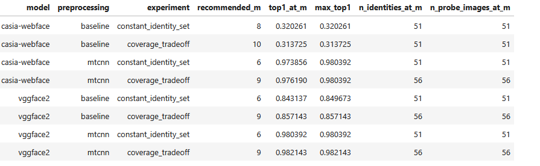

**Table 5.2.** Near-optimal $m$ values from the coverage-tradeoff and constant identity set experiments.

Two patterns are immediately apparent. First, the coverage tradeoff experiment consistently recommends higher values ($m=9$ or $m=10$) than the constant identity set experiment ($m=6$ or $m=8$), confirming that the former is biased upward by identity attrition. Second, the constant identity set results show that performance is already at or very near its maximum by $m=6$ under MTCNN preprocessing, meaning that the additional gallery images between $m=6$ and $m=10$ contribute essentially nothing to identification quality once the evaluation set is held constant.

Table 5.3 connects the constant identity set recommendation back to the coverage tradeoff experiment, so that the practical consequences of the recommended $m$
can be assessed. The first three data columns describe the constant identity set result: ``recommended_m_constant`` is the smallest $m$ at which Top-1 accuracy reaches within one percentage point of the maximum, ``top1_constant_at_m`` is the accuracy achieved at that point, and ``max_top1_constant`` is the best accuracy observed across all tested values of $m$ in this experiment. The next column, ``top1_coverage_at_same_m``, connects with the coverage tradeoff experiment, reporting the Top-1 accuracy from the coverage tradeoff experiment evaluated at the same $m$ that the constant identity set experiment recommended. Essentially, this answers the question "for the fixed $m$, what accuracy do we get when the full eligible population is evaluated rather than just the fixed 51 identities?" Finally, ``n_identities_coverage`` and ``n_probe_coverage`` report how many identities and probes survive the minimum-image filter at that value of $m$ in the coverage tradeoff design, which quantifies the coverage cost of the recommendation. 

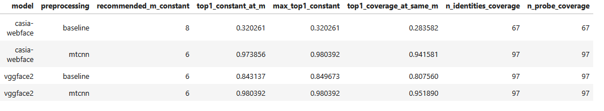

**Table 5.3.** Final recommendation. The constant identity set recommended $m$ is shown alongside its Top-1 under both experimental designs, as well as the number of identities retained in the coverage-tradeoff experiment at the same $m$.

For `vggface2` with MTCNN, the constant identity recommendation $m=6$ yields ``Top-1=0.9804`` on the fixed identity set and ``Top-1=0.9519`` under the coverage tradeoff design, while retaining 97 identities. By contrast, the coverage tradeoff optimum $m=9$ achieves ``Top-1=0.9821`` but retains only 56 identities. The gain from $m=9$ over $m=6$ is therefore negligible in absolute accuracy (less than one percentage point on the fixed set) while costing nearly half the identity coverage. The analogous pattern holds for `casia-webface` with MTCNN: $m=6$ yields 0.9739 on the constant set and 0.9416 under coverage-tradeoff with 97 retained identities, whereas $m=9$ reaches 0.9762 but only over 56 identities. In both cases, $m=6$ offers a much stronger balance between recognition quality and identity coverage.

The preprocessing comparison reveals an additional insight. For `casia-webface`, the constant identity recommendation shifts from $m=8$ under the baseline pipeline to $m=6$ after MTCNN, while absolute accuracy increases dramatically (from 0.3203 to 0.9739 at the recommended point). For `vggface2`, the recommendation remains $m=6$ with or without MTCNN, but the accuracy at that point rises from 0.8431 to 0.9804. This pattern mirrors the broader story of the project: improved preprocessing does not merely raise nominal performance but can also reduce the amount of gallery evidence needed to reach a stable identification plateau. In that sense, MTCNN makes the system not only more accurate but also more data-efficient.

### Dataset-specific aspects

Several features of IronClad shape this conclusion and should be kept in mind when generalizing. First, the gallery exhibits strong class imbalance: the majority of identities have only one or two images, so requiring even moderate $m$ values rapidly excludes most of the dataset. Second, each identity has exactly one probe image, making the evaluation particularly sensitive to identity attrition (losing an identity means losing its single evaluation sample). Third, because the selected embedding pipeline is already strong after MTCNN cropping, only a moderate amount of additional gallery diversity is needed before diminishing returns set in. On a dataset with many more images per person, with greater intra-class variation (for example, images spanning years of appearance change), or with a weaker embedding model, the optimal $m$ might shift upward. On IronClad, however, the observed image count distribution and the rapid plateau in the constant identity set experiment together justify a relatively small optimum.

### Conclusion

The final recommendation is based on the constant-identity-set experiment, with the coverage tradeoff results used as a complementary check. For the selected system (`vggface2` with MTCNN preprocessing), the best supported choice is $m=6$. This is the smallest value that achieves maximum Top-1 accuracy under the constant identity design, and it preserves substantially better identity coverage (97 identities) than the larger values favored by the confounded coverage-only analysis (56 identities at $m=9$). The same conclusion holds qualitatively for `casia-webface` under MTCNN, which also stabilizes around $m=6$. The practical answer to this design question is therefore: on IronClad, the optimal number of gallery images per identity is approximately six for the selected `vggface2` + MTCNN system.

## 6. Final recommendation

This report has addressed the design of a retrieval-based face identification system for IronClad through a sequence of five linked analyses, each isolating a specific design variable.

The recommended system configuration is: `vggface2` as the embedding backbone, MTCNN-based confidence-aware face cropping (threshold 0.80) as the preprocessing pipeline, cosine similarity as the retrieval distance, HNSW as the indexing strategy, a shortlist of $N^* = 12$ unique candidate identities returned per query, and approximately $m = 6$ gallery images stored per identity. Each of these choices was reached through controlled experimentation designed to attribute observed performance differences to the design variable under study rather than to confounding factors.

Two operational design parameters -the shortlist length $N$ and the gallery depth $m$- required more nuanced treatment than the selection of pipeline components. For $N$, the analysis introduced identity-level scoring (template centroids) and showed that $N^* = 12$ captures over 93% of probes for `vggface2` while sitting at the transition between the steep gain and diminishing returns regions of the Recall@N curve. A confidence-aware output policy further reduces the average returned list to approximately 2–3 identities without substantially sacrificing coverage. For the recommended number of images per identity, the analysis demonstrated that the straightforward approach of increasing $m$ and measuring the resulting accuracy is misleading, because the apparent improvement reflects two entangled effects: the genuine benefit of storing more images per person, and the artificial simplification of the recognition problem caused by dropping identities that lack enough images. The constant identity set experiment isolated the true effect and showed that performance saturates at $m=6$, well below the values suggested by the confounded design.

Several limitations should be acknowledged. The IronClad gallery is small relative to the billion-scale deployment target, and the scaling analysis relied on synthetic benchmarks and power-law extrapolation rather than direct measurement at production scale. The gallery-image distribution is heavily imbalanced (most identities have only one or two images) so the constant identity set experiment that isolates the true effect of gallery depth could only be conducted on the 51 identities with at least 10 images, a small fraction of the full dataset. The robustness evaluation covered three noise families (blur, resize, brightness) but did not include other common degradations such as occlusion, pose variation, or aging effects. Finally, the confidence-aware output policy was calibrated on closed-set behavior and has not been validated under open-set conditions where the probe identity may be absent from the gallery.

Despite these limitations, the analyses provide a coherent and empirically grounded design for the IronClad face identification system. The modular structure of the pipeline allows for individual components to be upgraded independently, without requiring a full system redesign.

